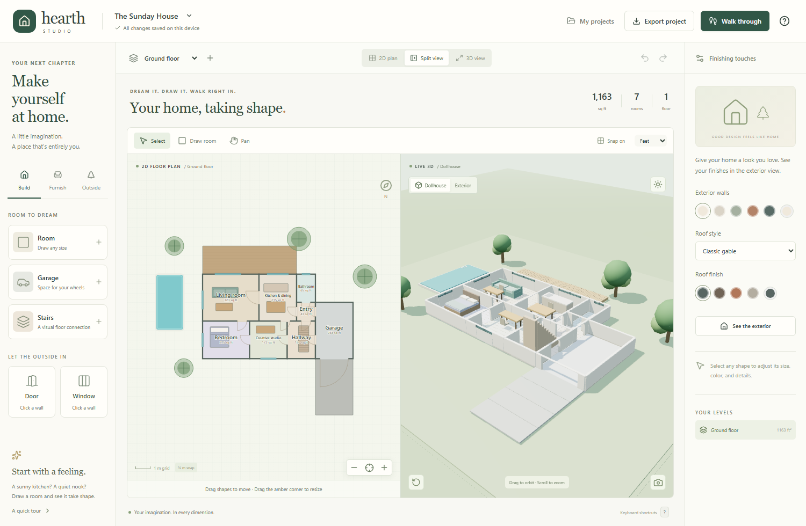
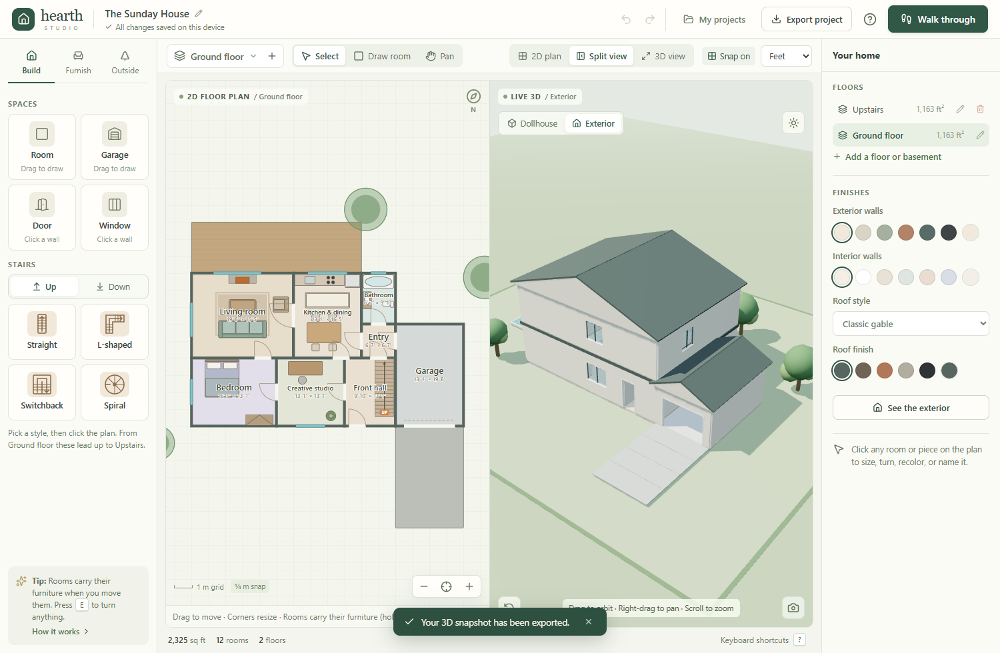

# Hearth Studio

Design your dream home, then walk through it. Draw rooms, add doors, windows, furniture, and stairs, stack floors, and see it all in 2D, as a 3D dollhouse, from outside, or on foot from the front door.





## Open Hearth Studio

**Open https://cbeaver728.github.io/hearth-studio/** in Edge or Chrome. Choose **Install app** in the address bar to get a desktop icon that opens in its own window and works offline. It works on phones and tablets too: on a tablet the details panel slides in from the right (**Home** / **Details** in the toolbar), and on a phone the catalog opens with **Add** and details rise from the bottom when you tap something. Split view stacks the plan over the 3D view on tall screens.

Or, without the internet: **Double-click `Hearth-Studio.html`.** That's the whole app in one file. Download it from this repository's Releases page, save it anywhere (the Desktop is fine), and it opens in Edge or Chrome. There is nothing to install, no command window, and no `.exe` for Windows security to block. It works offline.

Designs save automatically in that browser. Keep opening the same file in the same browser to find them again, and use **Export project** for backups or to move a design to another computer.

**Arthur's House** — the Read family home from PBS's _Arthur_ — comes built in, to tour from the street to D.W.'s dormer. It's laid out from the show's 1994 production floor plan and the Arthur Wiki: a yellow storey-and-a-half Cape with a blue roof and two dormers, the den left of the front door and the living room right, the foyer with its white winder stairs, the kitchen wing out back, the bedrooms up under the roof, the laundry in the basement, and Dad's catering garage at the end of the drive. It opens once when you update, sits in **My projects** after that (or **My projects → Tour Arthur's House**), and never replaces your own designs. It's also in `examples/Arthurs House.hearth`.

> **Coming from the first version?** Your designs live in the old app's browser storage. Open the old app once, choose **Export project** for each design, then in the new app choose **My projects → Open project file**.

Other ways to run it:

- **Windows executable:** `Hearth-Studio-*-Windows.exe` on Releases is an unsigned portable Electron build. Windows Device Guard / Smart App Control blocks unsigned executables on some PCs; use the HTML file there.
- **Local server:** the older `Hearth-Studio-Browser.zip` edition still works (`Start Hearth Studio.cmd`, needs Node.js 22+).

## Designing

1. **Rooms.** Choose **Draw room** (R) and drag on the grid. Drag a room to move it; its furniture comes along (hold Alt to move the room alone). Drag any amber corner to resize, or type exact sizes on the right. **Corners → Rounded** curves a room's corners, all four or just the ones you pick, to the radius you set; the walls, floor and walkthrough follow the curve.
   Each room has its own **wall paint**, **wallpaper** (stripes, check or floral) and **wainscot** — paneling to chair-rail height in a color of its own.
2. **Doors and openings.** Nine kinds: door, double doors, French doors (glass-paned, in a pair), sliding glass, garage door, window, **bay window** (it pushes out on three angled sides, with a window seat inside and its own little roof), wide opening, and **Remove wall** — which takes a whole wall out so two rooms become one (click it again to put the wall back). Click a wall to place one, drag it along the wall to move it, and change its type in the right panel. **Window styles:** classic (two sashes and a cross bar), plain (one clear pane), many panes, arched, or round — pick one in Build → Window style before clicking a wall, or change any window later in its room's panel. Each window can also take **curtains** inside, in any color, and **shutters**, a **raised panel** below, a **flower box** or a **crown** above on the outside.
3. **Curved walls.** Place one from Build, then drag its depth to bow it — half the width makes a half-round. Windows and doors go in it by clicking the curve, and they bend with it. Click just outside a room's wall and the curve sets itself on that wall, bowing out, with a wide opening into the room — a bay. Type a bigger width or depth and it grows outward, the opening widening with it. The space inside a curve gets its own floor and ceiling, and a roof that follows it round: a **cone** (like a bay or turret roof), a **dome**, or **flat** (the default on a flat-roofed house) — choose under Roof over the curve. Set two curves back to back for a round tower with a full turret cone. A Wide opening in the room wall joins the room to a bay.
4. **Ceilings.** Each room picks **Standard**, **Tall**, or **Open above**. Open runs the room right up through the floor above — a two-storey entry or stairway — and cuts the floor there; the panel warns if a room upstairs sits over it. Tall needs nothing built on top, and the roof rises to suit.
5. **Landings and balconies.** A landing is a platform at the current floor level: a porch by the front door, or a balcony upstairs, where it gets a rail. Tick **Covered** for a porch roof on posts.
6. **Furniture.** Over eighty pieces across Living, Kitchen & dining, Bedroom & office, Bathroom, Laundry & utility, On the walls, and Lighting. **Search the catalog** with the box at the top of the panel — type "bed", "island" or "light" and it looks across every tab.
   Beds come as king, queen or twin, plus a platform bed, a four-poster with drapes, a daybed, a loft bed with a desk under it, bunks and a crib. Seating runs from sofas and armchairs to a sectional, ottoman, daybed and bar stools; there's a pool table, a wet bar, a grand or upright piano with its bench, a grandfather clock and a Christmas tree. The kitchen has plain counter runs (straight or L-shaped), one with just a sink, the full counter with sink, cooktop and wall cabinets, islands with a sink, a cooktop, an L shape or round, ranges, dishwashers, pantry and linen cupboards, and wall cabinets. On the walls: pictures, gallery walls, mirrors and TVs; overhead: chandeliers, pendants, ceiling fans, floor lamps and wall lights.
   The Outside tab adds a shed, pergola, barbecue, swing set, trampoline, basketball hoop, mailbox, fire pit, hot tub, planter and bench. A preview follows your cursor, and pieces snap flush to walls. Set a bed, sofa, dresser, desk, wardrobe, TV, counter or appliance down near a wall and it turns to put its back to that wall; furniture always stays inside the room you drop it in. A door placed in a wall between a hall and a room swings into the room. Press **E** (or ↻ on the selection bar) to turn the selected piece; arrow keys nudge it. **Ctrl+C** then **Ctrl+V** on another floor pastes it in the same spot, handy for stacking bathrooms.
7. **Floors.** Use **+** beside the floor menu. Pick a stair style and Hearth lays connecting stairs on the floor below (or above, for a basement) plus a landing on the new floor to build around, with a couple of meters to step off at the top and never hanging out past the house below. Rename or delete floors in the right panel.
8. **Stairs.** Straight, L-shaped, winder (an L that turns on wedge-shaped steps instead of a landing), switchback, and spiral. Tick **Painted, with spindle rails** for white risers and turned spindles with a newel post, treads left in wood. Choose **Up** or **Down** before placing, or change it later on the right. Runs that turn a corner have **eight positions**: press **E** to work round the four quarter turns, again to carry on round the other way, or **Shift+E** (⇄ on the selection bar) to flip a run left for right straight away. On the plan, **UP** marks the bottom step and **DN** the top. Handrails climb beside each flight and a guard rail edges the opening upstairs — but only where they're needed: rails against a wall, or over thin air where nobody can walk, are left off. Stairs with no floor at the other end offer to create it.
9. **Sizes.** In feet, sizes read as feet and inches; type `12 6`, `12'6"`, or `12.5`.
   **Measure** (M) drags a tape between any two points; hold Shift to keep it straight.
10. **Share the plan.** The picture button under the plan saves the current floor as a PNG with the house name and floor as a title.
11. **Outside.** Patios, driveways, lawns, pools, trees, and fences live on the ground floor.
    **Exterior materials:** painted, lap siding, board & batten, cedar shingle, brick, stone, or stucco, each in a choice of colors that suit it. The roof takes shingles, standing-seam metal, or clay tile, in its own color, and interior paint is set separately. Then choose **See the exterior**.
    **Roof style** is a classic gable, a **hip** roof (sloping on every side, no gable walls), a **gambrel** barn roof (steep below, gentle above), a flat roof, or a **Cape Cod**: the top floor lives inside the roof, with knee walls and sloping ceilings, and a wing out the back gets its own ridge that meets the main roof in a valley. **Roof pitch** makes any pitched roof low, medium or steep. Every wing is roofed on its own, so a detached garage gets a roof of its own too. On a Cape, **dormers** (Build → Roof details) push out through the slope to make a nook you can stand in at the window; the plan hatches the eaves where the ceiling is too low to stand. Add a **chimney**, **shutters**, a **door color**, and white or dark **window frames**, and a picket fence with a gap for the gate.

### Versions, notes, and budget

With nothing selected, the right panel holds **Notes for this version** (shown on the project card, handy for "what we liked about this one") and a **rough build estimate** from finished square footage and an editable cost per square foot. Use **My projects → Make a copy** before trying a big change, then pick **Compare** on two cards to see their plans, bed/bath count, square footage, and estimate side by side.

Pieces from the show era are in the catalog too: a tube TV on its stand, a computer desk, a highchair, a changing table, a dollhouse, cast-iron radiators with a shelf, a round braided rug, a telephone table, a kitchen hutch and curtains. Sofas, beds, rugs, curtains and tablecloths take a **pattern** — stripes, check or floral.

## Walking through

Choose **Walk through**. You start outside the front door, full screen. Or double-click any room in the 3D view to start right there (a single click selects things in 3D, too). Set **Walkthrough starts → Out on the street** (bottom of the Finishes panel) to begin at the curb and walk up the path.

- **W A S D** or the on-screen arrows to walk, **drag** to look around, **Q/E** or ←/→ to turn, **Shift** to hurry.
- Walk onto the stairs to climb to the next floor. Walls, rails, and furniture block you; doorways don't. Brush a door frame, a newel post or the end of a rail and you slide past it instead of stopping dead. A basement stair can sit right under the main stair, and stairs beside each other don't get in each other's way.
- Balconies and decks upstairs keep their rails, with a gap where outside stairs come up onto them.
- The mini-map shows where you are on the current floor. Click it to jump somewhere. The floor buttons at the top take you straight to another level.
- **Tour** glides through each room in turn, hands-free, with the room's name on screen — the garage and a narrow galley kitchen too. In each room it stands where the most of the room is in view, rather than nose to a fridge. Touch any control to take over.
- The camera button saves a picture of the view. **Esc** returns to editing.

## Saving your work

Projects autosave locally. **My projects** holds your designs: duplicate one before trying a big change, or delete ones you're done with. **Export project** writes a `.hearth` file; **Open project file** imports one as a separate copy. Nothing is sent to GitHub or any server.

## Development

Requires Node.js 22.12+ (tested with Node.js 24) and npm.

```sh
npm ci
npm run dev            # browser development preview
npm run build:single   # release/Hearth Studio.html, the double-click edition
npm run desktop        # build and launch Electron
npm run package        # portable Windows executable
```

```sh
npm test               # unit tests (model, stairs, walkthrough physics, floors)
npm run test:e2e:edge  # browser tests using the installed Microsoft Edge
npx playwright install chromium && npm run test:e2e   # or with Playwright's Chromium
npm run test:desktop
```

## Architecture

- **React + TypeScript** for the editor, project library, inspector, and undo/redo (`src/App.tsx`).
- **SVG** floor plan with direct manipulation (`src/Plan.tsx`).
- **Three.js** scene with one long-lived renderer; the house is rebuilt as a group when the design changes (`src/Scene.tsx`, furniture models in `src/furniture3d.ts`).
- `src/stairs.ts` lays out each stair style in its own frame (treads, the opening it cuts, rails, and the plan arrow) and maps it through the item's rotation. The plan, the 3D model, and the walkthrough all use it.
- `src/walk.ts` is the walkthrough physics: floor surfaces with stair openings, tread heights, and collision boxes for walls, rails, and furniture.
- `src/floors.ts` adds floors with connecting stairs and a landing.
- `src/model.ts` defines the versioned project format, validation (older files without stair styles still open), the catalog, and shared-wall segmentation.
- **Electron** shell with a narrow preload bridge for native file dialogs.

## Boundaries

This is a concept-design studio, not construction or permit software.

- Rooms are rectangles; walls are axis-aligned with a fixed thickness. Floor-to-floor height is 3.2 m.
- Pieces turn in quarter turns. Stairs have 16 risers and stretch to fit their footprint.
- Roofs are simplified: a gable or flat roof over the top of each stack, flat roofs over lower parts with nothing above.
- Up to 1,000 shapes, eight upper floors, and three basements. The editor fits screens from a phone (about 360 px wide) up; the full three-panel layout appears on windows wider than 1100 px.
